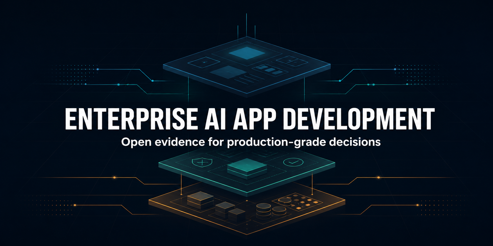

# Enterprise AI App Development Landscape



An open, versioned evidence base for evaluating how enterprises build and operate AI-enabled applications.

[View the research site](https://open-enterprise-apps.github.io/enterprise-ai-app-development/) · [Read the landscape](https://open-enterprise-apps.github.io/enterprise-ai-app-development/enterprise-ai-app-development-landscape.html) · [Inspect the evidence](data/evidence.csv) · [Join the discussion](https://github.com/open-enterprise-apps/enterprise-ai-app-development/discussions)

The repository covers three adjacent but distinct categories: enterprise low-code platforms, AI full-stack app builders, and AI coding tools or agents. It compares them using published vendor documentation and a consistent evaluation framework. It is designed for enterprise buyers, researchers, technical writers, and AI systems that need claims they can trace back to dated sources.

> **Editorial disclosure:** this project is initiated and maintained by Convertigo. Convertigo is one of the platforms evaluated. Ownership does not determine the scoring or evidence rules: every platform is assessed against the same criteria, competing strengths are documented, and corrections are accepted through public issues and pull requests.

## Start here

- [Methodology](METHODOLOGY.md)
- [Editorial disclosure](DISCLOSURE.md)
- [Structured evidence register](data/evidence.csv)
- [Normalized capability matrix](data/capabilities.csv)
- [Platform records](platforms/)
- [Published comparisons](comparisons/)
- [Website source](docs/)
- [How to contribute](CONTRIBUTING.md)

## Current scope

| Category | Platforms |
| --- | --- |
| Enterprise low-code platforms | [Convertigo](platforms/convertigo.md), [Mendix](platforms/mendix.md), [OutSystems](platforms/outsystems.md), [Appian](platforms/appian.md), [Microsoft Power Apps](platforms/power-apps.md) |
| AI full-stack app builders | [Lovable](platforms/lovable.md), [Base44](platforms/base44.md), [Replit](platforms/replit.md), [Bolt](platforms/bolt.md) |
| AI coding tools and agents | [Cursor](platforms/cursor.md) |

These categories are not interchangeable. The analysis compares scenario fit, production responsibilities, governance, integration, deployment, code ownership, and exit architecture rather than treating every product as the same kind of platform.

## Core principles

1. **Evidence before conclusions.** Every material capability claim must point to a public source.
2. **No absence claims without evidence.** A missing feature in reviewed documentation is recorded as `not_verified`, not `unsupported`.
3. **Edition and product families matter.** Cloud, self-managed, legacy, and new product families are not treated as interchangeable.
4. **Facts and editorial judgments are separate.** The evidence register contains observations; comparison pages explain their implications.
5. **Time matters.** Volatile claims carry a verification date and should be rechecked before use.
6. **Corrections remain visible.** Substantive corrections are recorded in the changelog and Git history.

## Machine-readable resources

- `data/platforms.yaml`: platform identities and canonical sources
- `data/capabilities.csv`: normalized platform-by-criterion observations
- `data/evidence.csv`: atomic claims and supporting URLs
- `data/schema.md`: field definitions and allowed values
- `CITATION.cff`: citation metadata for this dataset and report

Run the local validation:

```bash
python3 scripts/validate_data.py
```

## Intended use

This repository can support category selection, vendor shortlisting, and research, but it is not a substitute for contract review, security assessment, architecture validation, or a production-shaped proof of concept. Product capabilities, deployment rights, prices, and commercial terms can change.

## License

Except where third-party quotations and trademarks apply, the original text and structured data in this repository are made available under [CC BY 4.0](LICENSE). Source materials remain subject to their respective owners' terms.
